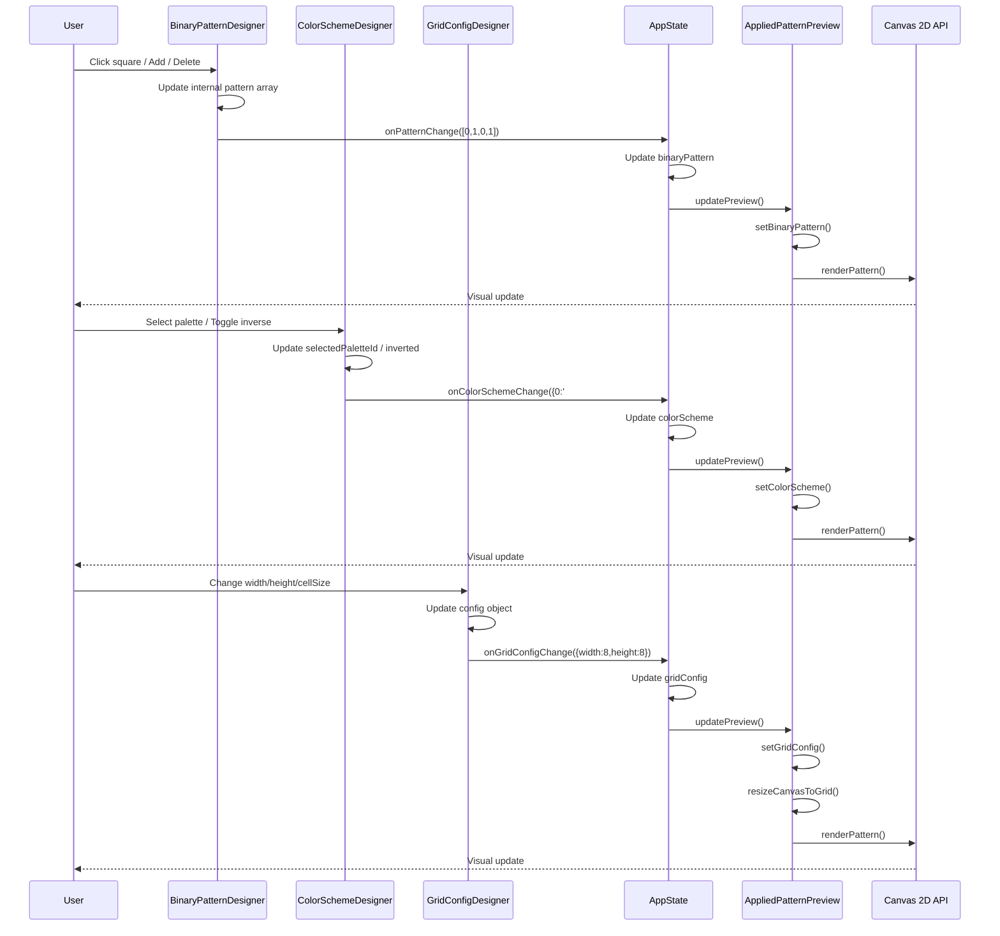
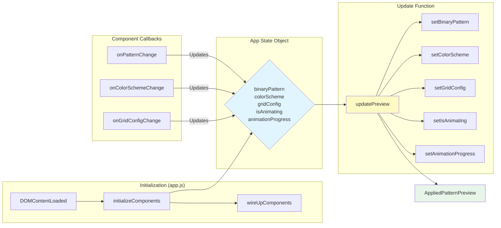
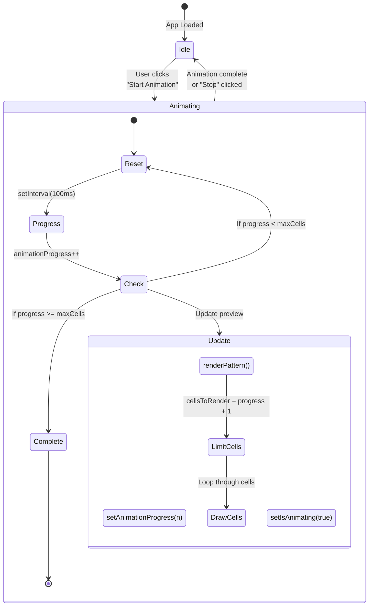
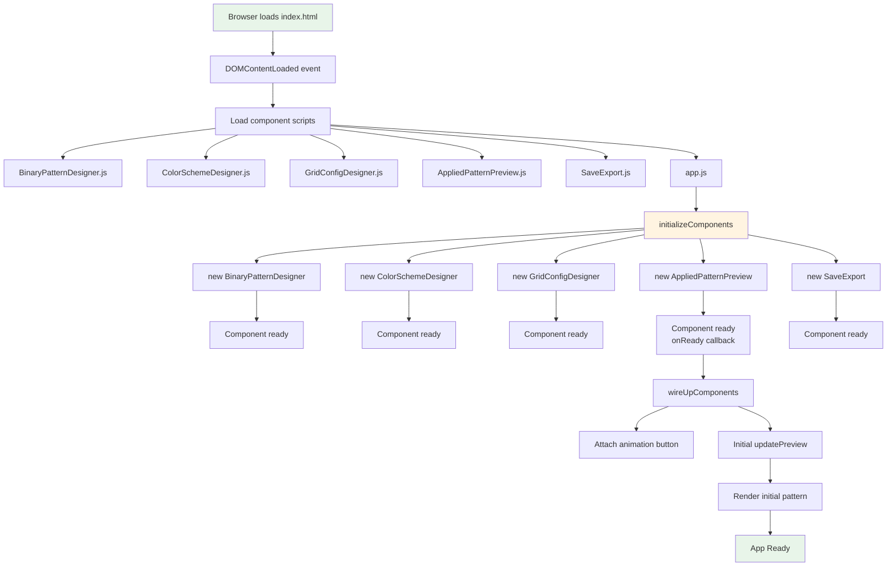
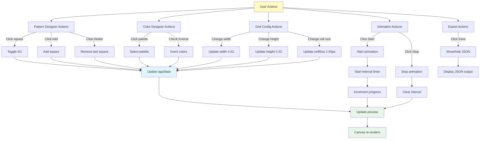
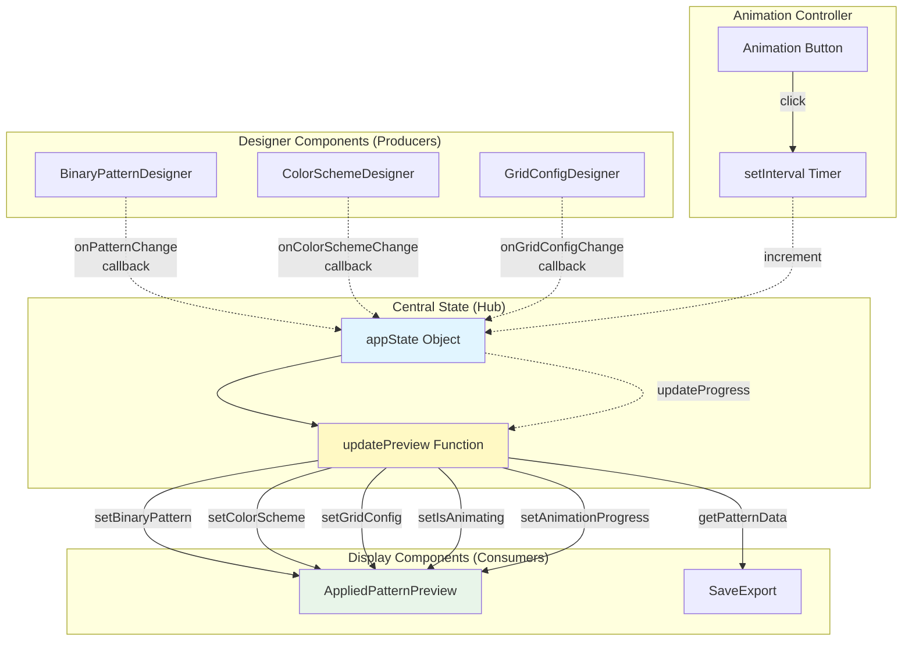

# Weaving Patterns v2 - Architecture Diagrams

This document explains how the integrated application works through visual diagrams.

## 1. Component Architecture

This diagram shows the overall structure of the application and how components are organized:

```mermaid
graph TB
    subgraph "index.html"
        HTML[HTML Container]
    end
    
    subgraph "app.js - Application State Manager"
        AppState[appState Object]
        AppState --> |binaryPattern| BP[Array: 0,1,0,1]
        AppState --> |colorScheme| CS[Object: 0/1 → hex]
        AppState --> |gridConfig| GC[Object: width/height/cellSize]
        AppState --> |isAnimating| ANIM[Boolean]
        AppState --> |animationProgress| PROG[Number]
    end
    
    subgraph "Component Layer"
        BPD[BinaryPatternDesigner<br/>Step 1: Pattern Input]
        CSD[ColorSchemeDesigner<br/>Step 2: Color Selection]
        GCD[GridConfigDesigner<br/>Step 3: Grid Config]
        APP[AppliedPatternPreview<br/>Preview: Canvas Renderer]
        SE[SaveExport<br/>Export: JSON Serialization]
    end
    
    HTML --> BPD
    HTML --> CSD
    HTML --> GCD
    HTML --> APP
    HTML --> SE
    
    AppState --> |read/write| BPD
    AppState --> |read/write| CSD
    AppState --> |read/write| GCD
    AppState --> |read| APP
    AppState --> |read| SE
    
    BPD -.-> |onPatternChange callback| AppState
    CSD -.-> |onColorSchemeChange callback| AppState
    GCD -.-> |onGridConfigChange callback| AppState
    AppState -.-> |updatePreview| APP
    
    style AppState fill:#e1f5ff
    style BPD fill:#fff4e1
    style CSD fill:#fff4e1
    style GCD fill:#fff4e1
    style APP fill:#e8f5e9
    style SE fill:#fce4ec
```



## 2. Data Flow Diagram

This diagram shows how data flows when a user interacts with the application:



## 3. State Management Flow

This diagram details how the centralized app state is managed:



## 4. Animation System Flow

This diagram explains how the animation system works:



## 5. Component Initialization Sequence

This diagram shows the order of component initialization and setup:



## 6. Rendering Pipeline

This diagram shows how the AppliedPatternPreview renders the pattern to canvas:

```mermaid
flowchart TD
    TRIGGER[Update Triggered] --> UPDATE[update method called]
    
    UPDATE --> RENDER[renderPattern method]
    
    RENDER --> CLEAR[Clear canvas]
    CLEAR --> BG[Fill white background]
    
    BG --> CALC[Calculate rendering parameters]
    CALC --> |If animating| ANIM_CALC[Calculate cellsToRender<br/>from animationProgress]
    CALC --> |If not animating| FULL_CALC[cellsToRender = maxCells]
    
    ANIM_CALC --> LOOP[Loop through cells 0 to cellsToRender]
    FULL_CALC --> LOOP
    
    LOOP --> POS[Calculate row/col position]
    POS --> PATTERN[Get pattern index:<br/>i % binaryPattern.length]
    PATTERN --> VALUE[Get pattern value:<br/>binaryPattern[index]]
    VALUE --> COLOR[Get color:<br/>colorScheme[value]]
    
    COLOR --> DRAW[Draw cell rectangle]
    DRAW --> LOOP
    
    LOOP --> |Loop complete| GRID[Draw grid lines]
    GRID --> DONE[Rendering complete]
    
    style TRIGGER fill:#fff9c4
    style RENDER fill:#e1f5ff
    style DRAW fill:#e8f5e9
    style DONE fill:#e8f5e9
```

## 7. User Interaction Map

This diagram maps all user interactions to their outcomes:



## 8. Component Communication Pattern

This diagram shows the communication pattern between components:



## Key Architecture Patterns

### 1. **Centralized State Management**
- All state lives in `appState` object in `app.js`
- Components are "dumb" - they receive callbacks to update state
- Single source of truth prevents inconsistencies

### 2. **Callback Pattern**
- Each designer component receives an `onChange` callback
- When internal state changes, component calls callback with new value
- App.js receives callback and updates central state

### 3. **Observer-like Pattern**
- When state changes, `updatePreview()` is called
- This propagates changes to all consumer components
- AppliedPatternPreview receives all updates and re-renders

### 4. **Component Isolation**
- Each component manages its own DOM rendering
- Components don't directly communicate with each other
- All communication goes through app.js

### 5. **Animation as State**
- Animation is controlled by state (`isAnimating`, `animationProgress`)
- Timer updates state, which triggers preview update
- Preview component reads state to determine what to render

